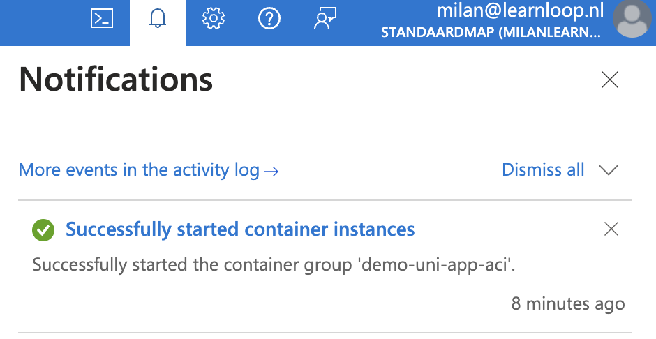
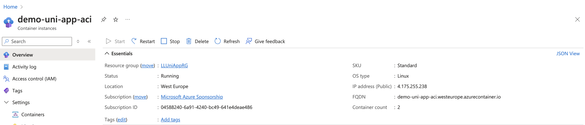
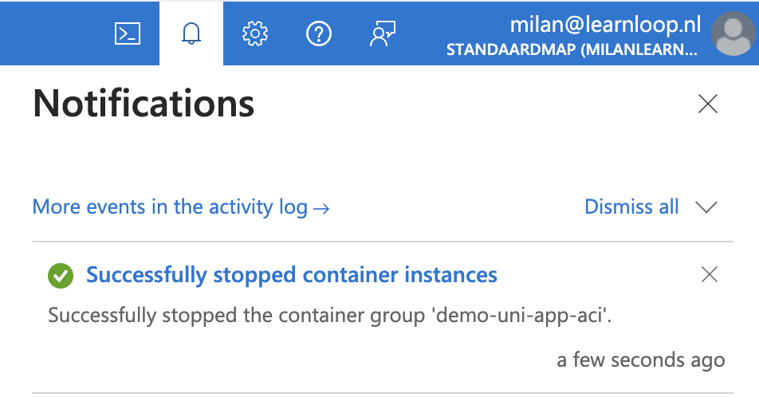
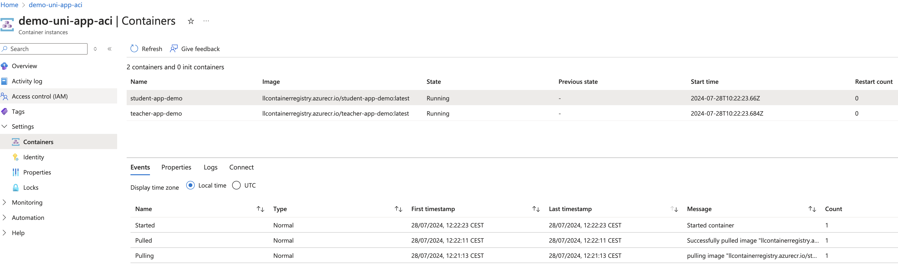

# LearnLoop README

This repository contains three distinct applications: authentication app, student app, and teacher app. Each app has its own Dockerfile and setup instructions. Follow the instructions below to set up and run each app.

## Setting up the virtual environment

### 1. Create virtual environment

Create a virtual environment named `.venv` in the current directory using the built-in `venv` module:

```
py -m venv .venv
```

### 2. Set PYTHONPATH environment variable

Set the value of the `PYTHONPATH` environment variable to the project path:

```
$env:PYTHONPATH = "C:\path\to\project_folder"
```

### 3. Activate the virtual environment (Windows)

Activate the virtual environment:

```
.venv\Scripts\activate
```

### 4. Install python version

Download and install the required Python version (replace `<version_number>` with the correct version number, which you can find at the top of the general_requirements.txt):

```
curl -o python-installer.exe <https://www.python.org/ftp/python/><version_number>/python-<version_number>-amd64.exe
```

### 5. Install requirements

Install the required packages:

```
pip install -r general_requirements.txt
```

### 6. Deactivate the virtual environment

To deactivate the virtual environment and return to the original shell environment, run:

```
deactivate
```

### 7. Set up environment variables

Ask LearnLoop admin for the project’s sensitive information. In the root directory of your project, create a `.env` file and add your sensitive information there:

```
OPENAI_API_KEY=<learnloops-api-key>
AZURE_OPENAI_ENDPOINT=<learnloops-azure-openai-endpoint>
COSMOS_URI=<learnloops-cosmos-uri>
MONGO_DB=<learnloops-mongo-db>
SURFCONEXT_CLIENT_SECRET=<learnloops-surfconext-client-secret>
FLASK_SECRET=<choose-one-yourself>
SURFCONEXT_CLIENT_ID=<learnloops-surfconext-client-id>
SURFCONEXT_METADATA_URL=<learnloops-surfconext-metadata-url>
```

## Running the applications

### General Instructions

Before running any of the applications in producten, ensure that all test settings in the `main.py` files are set to `False`.

### Install utils
For the three projects: teacher_app, student_app and auth_app we have shared utility function that are the same accross these three. For example open_ai wrapper calls. To install:

1. Change directory to the learnloop utils:
    
    ```
    cd learnloop
    ```
    
2. Install:
    
    ```
    pip install -e .
    ```

Now learnloop is installed as a module and you can "from learnloop import somde_module"

### Authentication app

#### Running without Docker

1. Change directory to the authentication app:
    
    ```
    cd auth_app
    ```
    
2. Run `main.py`:
    
    ```
    python main.py
    ```
    

#### Running with Docker

1. Start Docker Desktop to run the Docker daemon.
2. Build the Docker image for the authentication app:
    
    ```
    docker build -t auth_app -f .\auth_app\Dockerfile . 
    ```
    
3. Run the Docker container for the authentication app:
    
    ```
    docker run --env-file .env -p 3000:3000 auth-app
    ```
    

### Student app

#### Running without Docker

1. Change directory to the student app:
    
    ```
    cd student_app
    ```
    
2. Run `main.py`:
    
    ```
    streamlit run src/main.py
    ```
    

#### Running with Docker

1. Start Docker Desktop to run the Docker daemon.
2. Build the Docker image for the student app:
    
    ```
    docker build -t student_app -f .\student_app\Dockerfile .
    ```
    
3. Run the Docker container for the student app:
    
    ```
    docker run --env-file .env -p 8501:8501 student-app
    ```
    

### Teacher app

#### Running without Docker

1. Change directory to the teacher app:
    
    ```
    cd teacher_app
    ```
    
2. Run `main.py`:
    
    ```
    streamlit run src/main.py
    ```
    

#### Running with Docker

1. Start Docker Desktop to run the Docker daemon.
2. Build the Docker image for the teacher app:
    
    ```
    docker build -t teacher_app -f .\teacher_app\Dockerfile .
    ```
    
3. Run the Docker container for the teacher app:
    
    ```
    docker run --env-file .env -p 8502:8502 teacher-app
    ```

Follow these steps for each app as needed to set up and run the applications.

## Starting the demo in the Azure portal

### Steps
1. Navigate to the Azure Portal:
    Go to the Azure Portal and log in with your Azure account.

2. Locate the Resource Group:
    In the left-hand navigation pane, click on "Resource groups" and select the LLUniAppRG resource group.

3. Select the Container Instance:
    Within the resource group, locate and click on your container instance, demo-uni-app-aci. 

4. Start the container group by pressing the Start button:
    

5. Check for the notification that the container group has started running:
    

6. The student app can now be accessed at http://demo-uni-app-aci.westeurope.azurecontainer.io:8501/app/ and the teacher app can at http://demo-uni-app-aci.westeurope.azurecontainer.io:8502/app/.

7. Stop the container instance by pressing the stop button:
    
    And wait for the notification:
    


## Deploying a new version of the demo in Azure Container Instances

### Prerequisites

1. Install Docker on your local machine. (https://www.docker.com/get-started/)

2. Install Azure CLI. (https://learn.microsoft.com/en-us/cli/azure/install-azure-cli)

3. Ensure with the LearnLoop admin that your account has access to the Azure Container Registry (ACR) and necessary permissions to push images and manage container instances.

### Steps
1. Log in to your Azure account using the Azure CLI:
    ```
    az login
    ```
    Follow the instructions in the browser to complete the authentication process.

2. Log in to Azure Container Registry (ACR):
    ```
    az acr login -n llcontainerregistry
    ```

3. Build and push Docker images
    Student app docker image:
    Navigate to the `student_app` folder:
    ```
    cd student_app
    ```
    Build the Docker image:
    ```
    docker buildx build --platform linux/amd64 -t <yourdockerregistry>/student-app-demo:latest . --load && \
    docker tag <yourdockerregistry>/student-app-demo:latest <YourACRName>.azurecr.io/student-app-demo:latest && \
    docker push <YourACRName>.azurecr.io/student-app-demo:latest
    ```
    Teacher App Docker Image:
    Navigate to the `teacher_app` folder:
    ```
    cd teacher_app
    ```
    Build the Docker image:
    ```
    docker buildx build --platform linux/amd64 -t <yourlocaldockerregistry>/teacher-app-demo:latest . --load && \
    docker tag <yourlocaldockerregistry>/teacher-app-demo:latest llcontainerregistry.azurecr.io/teacher-app-demo:latest && \
    docker push llcontainerregistry.azurecr.io/teacher-app-demo:latest
    ```

4. Update the Azure Container Instance (ACI) deployment
    To update the existing deployment, use the following command. Note that although the command says `create`, it will update the existing resources if they already exist:
    ```
    az container create --resource-group LLUniAppRG --file azure_deployment/deploy-aci.yaml
    ```

5. Verify deployment in Azure portal
    1. Navigate to the Azure Portal:
    Go to the Azure Portal and log in with your Azure account.

    2. Locate the Resource Group:
    In the left-hand navigation pane, click on "Resource groups" and select the LLUniAppRG resource group.

    3. Select the Container Instance:
    Within the resource group, locate and click on your container instance, demo-uni-app-aci. 
    
    4. Check if the container app is running:
    
    
    

    5. The student app can now be accessed at http://demo-uni-app-aci.westeurope.azurecontainer.io:8501/app/ and the teacher app can at http://demo-uni-app-aci.westeurope.azurecontainer.io:8502/app/.

    6. Stop the container instance by pressing the stop button:
    
    And wait for the notification:
    